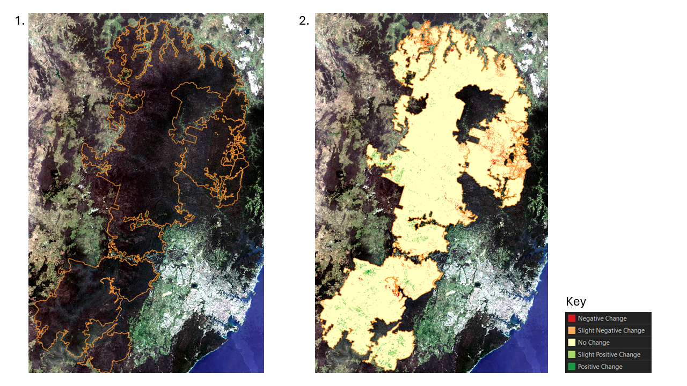

# Sentinel 2 Change Detection, Greater Blue Mountains World Heritage Area 
This project was completed as a part of [Birdlife Australia's](https://birdlife.org.au/) annual Key Biodiversity Area (KBA) Easter Health Check (EHC) for the Greater Blue Mountains region. The EHC requires an assessment of the impact of various factors on the health of KBA's, such as development, fire, and recreational activities. Due to the large size of the Greater Blue Mountains KBA, a remote sensing change detection technique was employed to identify areas of change between the current and previous years, and between the current year and the mean of the previous five years. Sentinel 2 red, green, blue and near-infrared data for January - March in each year of the study period was sourced from the [Digital Earth Australia’s](https://www.dea.ga.gov.au/) Open Data Cube. The Normalised Difference Vegetation Index was derived, then each three-month period was resampled to a single time step. Differencing was performed on the NDVI band to give a current minus previous year and a current minus mean-of-five-previous-years image. The two difference images were then classified using thresholds to highlight areas of potential change. This process enabled the accurate assessment of vegetation change across the KBA.

**Key**
1. True-colour composite of the study area
2. Threshold-based NDVI difference classification map

[View the Project on GitHub >>](https://github.com/mjdear68/Greater-Blue-Mountains-KBA-Change-Detection-2024)
