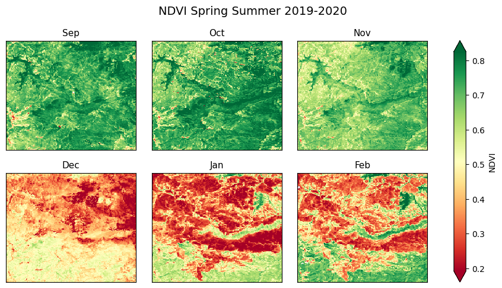

# Beginner's Guide to Remote Sensing With Python
I could not have completed my Graduate Diploma research project without the assistance of the vibrant and supportive coding community that can be found on sites such as [Stack overflow](https://stackoverflow.com/), [Geographic Information Systems](https://gis.stackexchange.com/), and [Cross Validated](https://stats.stackexchange.com/). In an effort to give back some of what I learned along the way, I created a collection of short Jupyter Notebook tutorials called the [Beginner's Guide to Remote Sensing With Python](https://github.com/mjdear68/Beginners_Guide_to_Remote_Sensing_With_Python). The tutorials are intended to be at a level accessible to people with minimal to intermediate Python experience, with each covering a common remote sensing task. They are published on GitHub at [https://github.com/mjdear68/Beginners_Guide_to_Remote_Sensing_With_Python](https://github.com/mjdear68/Beginners_Guide_to_Remote_Sensing_With_Python). The code and image below are extracted from the [Further Techniques](https://github.com/mjdear68/Beginners_Guide_to_Remote_Sensing_With_Python/blob/master/Notebooks/Further_Techniques.ipynb) notebook.

```python
subplot_titles = ['Sep', 'Oct', 'Nov', 'Dec', 'Jan', 'Feb']

fg = NDVI.sel(time=slice('2019-09','2020-02')).plot(col='time', 
                                                    cmap='RdYlGn', 
                                                    figsize=(10,5), 
                                                    robust=True, 
                                                    col_wrap=3,
                                                    cbar_kwargs={'label':'NDVI'})

for i, ax in enumerate(fg.axs.flat):
        remove_labels_ticks(ax)
        ax.set_title(subplot_titles[i], fontsize=11)

fg.fig.suptitle('NDVI Spring Summer 2019-2020', y=1.05, fontsize=14);
```




[View the Project on GitHub >>](https://github.com/mjdear68/Beginners_Guide_to_Remote_Sensing_With_Python)
