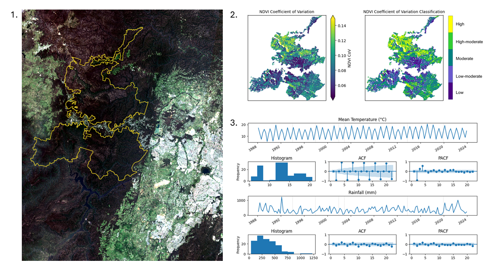

#Landsat NDVI Time Series 1988-2023, Blue Mountains National Park
This research project was a major component of the Graduate Diploma in Science (Applied Statistics) that I completed between June 2021 and February 2024. In this study a 3-monthly season-based time-series of the Normalised Difference Vegetation Index (NDVI) derived from [Digital Earth Australia’s](https://www.dea.ga.gov.au/) Landsat data cube was used to assess the spatial and temporal dynamics of native vegetation in a portion of the Blue Mountains National Park, New South Wales, Australia, for the 36-year period 1988-2023. The project demonstrated that higher variability in vegetation greeness was associated with areas and vegetation forms impacted more frequently by forest fires. The project required the use of several major Python data analysis and visualisation libraries including [Xarray](https://docs.xarray.dev/en/stable/index.html),  [Matplotlib](https://matplotlib.org/stable/index.html), [GeoPandas](https://geopandas.org/en/stable/), [Pandas](https://pandas.pydata.org/docs/index.html), [Rioxarray](https://corteva.github.io/rioxarray/stable/), and [Jupyter Lab](https://docs.jupyter.org/en/latest/). Analysis techniques included threshold classification, determining causes of time series non-stationarity, and cross-correlation of NDVI time series with climatic time series.

The following visualisations were produced using Python code as a part of the project.

**Key**
1. True-colour composite of the study area
2. Spatial plot and classification of the NDVI Coefficient of Variation
3. Time series plots of climatic variables

